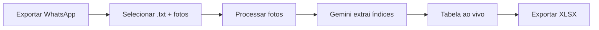

# Leitor de Hidrômetros

> [!info] Resumo
> Site em **Next.js 14** (App Router) que lê fotos de hidrômetros enviadas via WhatsApp, usa a API de visão do **Google Gemini** para extrair os índices automaticamente, e gera uma planilha Excel — tudo no navegador.

## Fluxo de Trabalho



## Arquitetura

| Camada | Tecnologia | Arquivo |
|--------|------------|---------|
| Frontend | React 18 + Next.js 14 App Router | `app/page.tsx` |
| API | Route Handlers (Node.js) | `app/api/extract/route.ts` |
| Parse | TypeScript puro | `lib/parseChat.ts` |
| Agrupamento | TypeScript puro | `lib/results.ts` |
| IA | Google Gemini 2.0 Flash | `lib/gemini.ts` |
| OCR Fallback | Tesseract.js | `lib/tesseract.ts` |
| Planilha | SheetJS (xlsx) | `package.json` |

## Funcionalidades Principais

- **Importação**: Seleciona arquivo `.txt` exportado do WhatsApp + pasta de fotos
- **Filtros por data**: Intervalo opcional de datas para processar lotes específicos
- **Compressão automática**: Fotos redimensionadas para máx. 1600px (JPEG 85%)
- **Processamento paralelo**: 4 fotos simultâneas (configurável via `CONCURRENCY`)
- **Progresso ao vivo**: Barra de progresso com contagem de fotos processadas
- **Tabela por apartamento**: Índice, confiança (alta/média/baixa) e observações
- **Exportação XLSX**: Planilha formatada com colunas para Apartamento, Índice, Confiança, Observação e Arquivo(s)

## Estrutura de Arquivos

```
hidrometro-app-web/
├── app/
│   ├── layout.tsx          # Layout raíz (fontes: Space Grotesk, IBM Plex Mono, Inter)
│   ├── page.tsx            # Página principal (componente client)
│   ├── globals.css         # Estilos globais
│   └── api/extract/
│       └── route.ts        # API de extração (Gemini)
├── lib/
│   ├── parseChat.ts        # Parser do export WhatsApp
│   ├── results.ts          # Agrupamento por apartamento
│   ├── gemini.ts           # Service Google Gemini
│   └── tesseract.ts        # Service Tesseract.js (fallback)
├── package.json            # Dependências
└── next.config.mjs         # Configuração Next.js
```

## Configuração

> [!warning] Variável de Ambiente
> É necessário configurar `GEMINI_API_KEY` em `.env.local` (obtida em [aistudio.google.com](https://aistudio.google.com/apikey))

```bash
npm install
cp .env.example .env.local
# Editar .env.local com sua chave API do Gemini
npm run dev
```

## API de Extração

A API em `app/api/extract/route.ts`:

- Recebe: arquivo, apartamentos esperados, imagem em base64, mediaType
- Envia para Gemini com prompt que instru leitura de hidrômetros
- Retorna: JSON com medidores (posição, índice inteiro, decimal, confiança, observação)
- Modelo: `gemini-2.0-flash`
- Retry automático: 3 tentativas com delay de 10s em caso de quota

## Parse do Chat WhatsApp

O parser em `lib/parseChat.ts`:

- Extrai anexos de imagem do formato WhatsApp (`IMG-YYYYMMDD-WAXXXX.jpg`)
- Identifica apartamentos em legendas (regex: `\b(\d{1,4}[A-Za-z]{1,2}|[A-Za-z]{1,2}\d{1,4})\b`)
- Detecta flags: `sem_acesso`, `sem_legenda`, `formato_inesperado`, `mais_de_2_no_mesmo_bloco`
- Herda legendas da foto anterior quando ausente

## Agrupamento por Apartamento

O módulo em `lib/results.ts`:

- Agrupa leituras por apartamento
- Detecta divergências entre fotos do mesmo apê (destaque vermelho)
- Marca confiança baseada na consistência entre leituras
- Ordena por número do apartamento

## Cores na Tabela

| Cor | Significado |
|-----|-------------|
| Sem cor | Confiança alta, leitura consistente |
| Amarelo (`low`) | Confiança média ou baixa - vale conferir |
| Vermelho (`danger`) | Divergência entre fotos ou falha de leitura - revisão manual |

## Deploy

### Vercel (Recomendado)

1. Subir repositório no GitHub
2. Importar na Vercel
3. Configurar `GEMINI_API_KEY` em Environment Variables
4. Deploy automático

### Local

```bash
npm run build
npm start
```

## Notas Técnicas

> [!tip] Otimizações
> - Fotos comprimidas antes do envio (economiza tokens e custo da API)
> - Processamento paralelo para agilizar lotes grandes
> - Sem banco de dados - tudo processado no navegador
> - Retry automático com backoff em caso de rate limit

> [!caution] Limitações
> - Se a aba for fechada, o processamento é perdido
> - Para lotes > 1000 fotos, usar filtros de data
> - Quota gratuita do Gemini: 15 requests/minuto
> - Vercel free tier: timeout de 10 segundos por request

## Dependências

- **@google/generative-ai** ^0.24.0 - SDK Google Gemini
- **tesseract.js** ^5.1.1 - OCR como fallback
- **next** 14.2.35 - Framework React
- **react** ^18.3.1 - UI Library
- **xlsx** ^0.18.5 - SheetJS para exportação Excel

---

## Roadmap de Melhorias

### Funcionalidades
- [x] Trocar Claude por Gemini (gratuito)
- [x] Retry automático em caso de quota
- [x] **Edição manual** — Corrigir índices na tabela antes de exportar
- [x] **Histórico** — Salvar leituras no localStorage para comparar meses
- [x] **Cálculo de consumo** — Subtrair índice anterior do atual
- [x] **Suporte a múltiplos formatos** — Telegram, iMessage, etc
- [x] **Exportar PDF** — Documento formatado com tabela e rodapé
- [x] **Compartilhar via link** — Link com hash encode para compartilhar resultados

### UX/UI
- [x] **Preview das fotos** — Thumbnail ao passar mouse
- [x] **Skeleton loading** — Animações enquanto processa
- [x] **Notificação sonora** — Alertar quando terminar
- [x] **Drag & drop** — Arrastar arquivos direto na tela
- [x] **Modo escuro** — Toggle dark/light
- [x] **Tabela responsiva** — Melhor no celular
- [x] **Acessibilidade** — ARIA labels, keyboard navigation, focus-visible

### Infraestrutura
- [x] **Testes** — Vitest para testes unitários
- [x] **Linting** — ESLint + Prettier
- [x] **CI/CD** — GitHub Actions
- [x] **Rate limit inteligente** — Delay entre requests
- [x] **Cache** — Evitar reprocessar fotos já lidas

### Futuro
- [x] **Testes E2E** — Playwright para testes de integração
- [x] **Performance** — Lazy load, memoização avançada
- [x] **Exportar CSV** — Formato leve para importar em outros sistemas
- [x] **PWA offline** — Service worker + manifest para funcionar sem internet
- [x] **Dashboard com gráficos** — Visualização de consumo por apartamento (recharts)
- [x] **Notificação push** — Alertar quando quota Gemini esgotada
- [x] **Comparar 3+ períodos** — Evolução do consumo ao longo do tempo
- [x] **Dark mode automático** — Detectar preferência do sistema operacional
