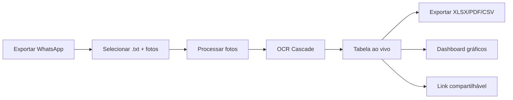

# Leitor de Hidrômetros

> [!info] Resumo
> Site em **Next.js 14** (App Router) que lê fotos de hidrômetros enviadas via WhatsApp, usa **OCR.space** (gratuito) para extrair os índices automaticamente, e gera planilhas — tudo no navegador. Deploy no **Railway**.

## Fluxo de Trabalho



## Arquitetura

| Camada | Tecnologia | Arquivo |
|--------|------------|---------|
| Frontend | React 18 + Next.js 14 App Router | `app/page.tsx` |
| API | Route Handlers (Node.js) | `app/api/extract/route.ts` |
| Parser | TypeScript puro | `lib/parseChat.ts` |
| OCR Principal | OCR.space (25k req/mês grátis) | `lib/ocrspace.ts` |
| OCR Reserva | Google Gemini (requer billing) | `lib/gemini.ts` |
| OCR Fallback | Tesseract.js (local WASM) | `lib/tesseract.ts` |
| Dashboard | Recharts 3 | `components/Dashboard.tsx` |
| Export | SheetJS + jsPDF | `lib/exportPdf.ts` |
| Cache | IndexedDB | `lib/cache.ts` |
| Deploy | Railway | `.github/workflows/ci.yml` |

## Funcionalidades Implementadas

### Entrada de Dados
- [x] **Chat parser multi-plataforma** — WhatsApp, Telegram, iMessage com detecção automática
- [x] **Drag & drop** — Arquivo `.txt` + pasta de fotos
- [x] **Filtro por data** — Intervalo de dias antes de processar
- [x] **Preview de fotos** — Thumbnail ao passar mouse

### OCR Cascade
- [x] **OCR.space** — API gratuita (25k req/més), alta precisão
- [x] **Gemini AI** — Google Vision (requer billing habilitado)
- [x] **Tesseract.js** — Fallback local, funciona offline
- [x] **Remoção de prefixo data URI** — Compatibilidade entre módulos

### Processamento
- [x] **Compressão inteligente** — 1600px, JPEG 85% antes de enviar
- [x] **Concorrência controlada** — 3 fotos simultâneas, 600ms delay
- [x] **Cache IndexedDB** — Fotos já processadas não reenviadas
- [x] **Cancelamento** — Interrompa a qualquer momento
- [x] **Retry automático** — Backoff em caso de quota/rate limit
- [x] **Notificação de quota** — Alerta quando API atinge limite

### Resultados
- [x] **Edição inline** — Corrigir índices na tabela
- [x] **Cálculo de consumo** — Subtrair índice anterior do atual
- [x] **Agrupamento por apartamento** — Detecta divergências
- [x] **Cores de confiança** — Verde/alta, Amarelo/média, Vermelho/baixa
- [x] **Skeleton loading** — Animação enquanto processa

### Exportação
- [x] **XLSX** — Planilha Excel formatada
- [x] **PDF** — Relatório com jsPDF + auto-tabela
- [x] **CSV** — UTF-8 BOM para Excel
- [x] **Link compartilhável** — URL encriptada com base64

### Dashboard
- [x] **Gráfico de barras** — Consumo por apartamento
- [x] **Gráfico de pizza** — Distribuição de confiança
- [x] **Evolução multi-período** — Comparar consumo entre meses
- [x] **Toggle por apartamento** — Selecionar quais mostrar

### UX/UI
- [x] **Tema dark/light** — Detecção automática do sistema
- [x] **PWA offline** — Service Worker para assets estáticos
- [x] **Responsivo** — Desktop, tablet e mobile
- [x] **Acessibilidade** — ARIA labels, keyboard nav, focus-visible
- [x] **Error boundary** — Tratamento de erros elegante
- [x] **Notificação sonora** — Alerta ao terminar

### Infraestrutura
- [x] **CI/CD** — GitHub Actions (lint, test, build)
- [x] **Testes unitários** — Vitest (85 testes)
- [x] **Testes E2E** — Playwright (7 testes)
- [x] **ESLint 9** — Flat config
- [x] **Deploy Railway** — Hosting + domínio público

---

## Roadmap — Novas Funcionalidades

### 🎯 Alta Prioridade

- [x] **Entrada manual de índices** — Formulário para digitar índice quando OCR falha ou foto não existe
- [x] **Cálculo de tarifa de água** — Configurar faixas de preço (m³) e calcular valor por apartamento
- [x] **Alerta de consumo anormal** — Sinalizar apês com consumo 2x acima da média (possível vazamento)
- [x] **Relatório de comparação PDF** — PDF bonito comparando 2 períodos lado a lado
- [x] Separar os blocos de A ao H por apartamento, por exemplo colocar primeiro do bloco A e depois B etc

### 📊 Média Prioridade

- [x] **Importar leituras via XLSX** — Carregar leituras anteriores de planilha existente
- [x] **Modo offline completo** — Tesseract como OCR principal sem API externa
- [x] **Backup/Restore** — Exportar/importar histórico completo como JSON
- [ ] **Multi-usuário com login** — Síndicos/funcionários com seus próprios históricos

### 🚀 Baixa Prioridade

- [ ] **WhatsApp Bot** — Enviar fotos e receber leitura de volta
- [ ] **API REST para condomínios** — Endpoint para sistemas externos puxarem leituras
- [ ] **Detecção de anomalias com IA** — Analisar padrões e prever problemas
- [ ] **i18n** — Português, Espanhol, Inglês

---

## Novas Sugestões de Funcionalidades

### 📱 Mobile & Acessibilidade

- [ ] **Gesture de swipe** — Deslizar para navegar entre fotos no mobile
- [ ] **Modo uma mão** — Layout otimizado para uso com uma mão no celular
- [ ] **Voice feedback** — Leitura por voz do índice extraído (acessibilidade)
- [ ] **Zoom na foto** — Pinch-to-zoom para verificar detalhes da imagem
- [ ] **Modo alto contraste** — Tema acessível para deficientes visuais

### 📸 Câmera & Captura

- [ ] **Captura direta pela câmera** — Tirar foto pelo app sem exportar do WhatsApp
- [ ] **Multi-câmera** — Várias fotos do mesmo hidrômetro para aumentar confiança
- [ ] **Flash automático** — Ajustar exposição para ambientes escuros
- [ ] **OCR em tempo real** — Preview ao vivo enquanto aponta a câmera

### 📊 Analytics & Relatórios

- [ ] **Previsão de consumo** — IA prevê consumo dos próximos meses baseado no histórico
- [ ] **Ranking de consumo** — Apartamentos que mais/menos consumiram no período
- [ ] **Mapa de calor** — Visualização por andar/bloco com cores por consumo
- [ ] **Comparar com média do prédio** — Benchmark individual vs coletivo
- [ ] **Relatório automático mensal** — Gera PDF todo mês e envia por email
- [ ] **Gráfico de tendência** — Regressão linear mostrando se consumo está subindo/descendo

### 🔔 Notificações & Automação

- [ ] **Lembrete de leitura** — Push notification para não esquecer de ler os hidrômetros
- [ ] **Alerta de aumento >20%** — Notificação quando consumo sobe significativamente
- [ ] **Resumo semanal por email** — Envia digest com consumo da semana
- [ ] **Webhook** — Notifica sistemas externos quando leitura é concluída
- [ ] **Agendamento** — Processar automaticamente em horário definido

### 🏢 Gestão de Prédios

- [x] **Multi-prédio** — Gerenciar vários condomínios no mesmo app
- [x] **Estrutura do prédio** — Configurar andares, bloco, quantidade de apts
- [ ] **Tarifa progressiva** — Configurar faixas de preço por faixa de consumo
- [ ] **Rateio de água** — Calcular rateio comum + individual
- [ ] **Histórico por bloco** — Agrupar por bloco além de apartamento
- [ ] **Síndico vs Proprietário** — Dois modos de visualização com permissões diferentes

### 💰 Financeiro

- [ ] **Calcular conta de água** — Integrar com tabela de tarifas da concessionária
- [ ] **Boleto automático** — Gerar cobrança por apartamento baseado no consumo
- [ ] **Dívida ativa** — Rastrear apartamentos que não pagaram
- [ ] **Comparar com meses anteriores** — Mostrar variação % e valor financeiro

### 🔗 Integrações

- [ ] **Google Sheets** — Sincronizar resultados com planilha online
- [ ] **Slack/Telegram Bot** — Enviar resultado do dia automaticamente
- [ ] **API pública** — REST API documentada para integrações externas
- [ ] **Webhook para sistemas condominiais** — CondominioPay, iSyCred, etc
- [ ] **Importar do Google Fotos** — Puxar fotos automaticamente
- [ ] **Zapier/IFTTT** — Automações sem código

### 🎨 UX Premium

- [x] **Onboarding interativo** — Tutorial passo a passo na primeira vez (Framer Motion)
- [x] **Temas personalizados** — Usuário escolhe cores do app (7 paletas + hex custom)
- [x] **Animações de transição** — Framer Motion entre telas (FadeIn, SlideIn, Stagger)
- [x] **Dark mode por schedule** — Escuro de noite, claro de dia (fixo + geolocalização)
- [x] **Modo presentation** — Tela cheia para projetor/reunião de síndico (fullscreen)
- [x] **Customizar colunas da tabela** — Escolher quais colunas mostrar/esconder
- [x] **Modo uma mão** — Bottom bar com atalhos para mobile

### 🧪 Qualidade & Segurança

- [x] **Validação de OCR** — Marcar leituras improváveis (ex: índice > 99999)
- [x] **Detecção de foto duplicada** — Mesma foto enviada 2 vezes
- [ ] **Criptografia do histórico** — Proteger dados sensíveis no localStorage
- [ ] **Auditoria** — Log de quem alterou qual índice e quando
- [x] **Watermark no PDF** — Marca d'água com data e hora de geração

### 🌐 Offline & Performance

- [x] **Service Worker avançado** — Cache de imagens com LRU, stale-while-revalidate, network-first pages
- [x] **WebAssembly OCR** — Tesseract otimizado com WASM SIMD
- [x] **Processamento em Web Worker** — OCR off-thread via `lib/ocrWorker.worker.ts`
- [x] **Lazy load de imagens** — IntersectionObserver via `components/LazyImage.tsx`
- [x] **Compressão server-side** — `/api/compress` route com fallback client-side

---

## Deploy

### Railway (atual)
- URL: https://hidrometro-app-web-production.up.railway.app
- Deploy automático via GitHub

### Local
```bash
npm install
cp .env.example .env.local
# Editar .env.local (OCR_SPACE_API_KEY opcional)
npm run dev
```

## Comandos

| Comando | Descrição |
|---------|-----------|
| `npm run dev` | Servidor de desenvolvimento |
| `npm run build` | Build de produção |
| `npm run start` | Iniciar em produção |
| `npm run lint` | Verificar código |
| `npm run test` | Testes unitários |
| `npm run test:e2e` | Testes E2E |
| `npm run format` | Formatar código |

## Variáveis de Ambiente

| Variável | Obrigatória | Descrição |
|----------|-------------|-----------|
| `OCR_SPACE_API_KEY` | Não | OCR.space (25k req/mês grátis) |
| `GEMINI_API_KEY` | Não | Google Gemini (requer billing) |

> [!tip] App funciona sem nenhuma chave — usa Tesseract.js como fallback local
